# Hand Pose Estimation with Hand Detection
## Overview

In this project I am striving to achieve real-time hand tracking and hand pose estimation. This is an educational project, there already exist better open source models that solve this problem such as MediaPipe Hands, OpenPose, etc. 

This project is still work in progress. 
To achieve my goal I followed the next plan:

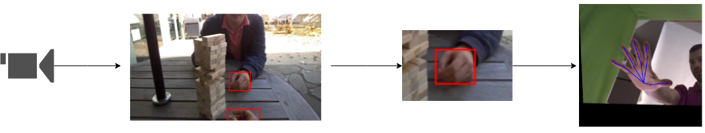

## Detection
As a model for the detection of the hands I used Faster-RCNN pretrained on COCO dataset and with ResNet50 as a backbone. I fine-tuned this model using EgoHand dataset.

### EgoHand dataset
This dataset consists of 48 videos and in total 4800 frames for training. It consists of images of first-person interactions of 2 people playing board games in different settings. The annotations were provided in a Matlab file.

Citations:

    @InProceedings{Bambach_2015_ICCV,
    author = {Bambach, Sven and Lee, Stefan and Crandall, David J. and Yu, Chen},
    title = {Lending A Hand: Detecting Hands and Recognizing Activities in Complex Egocentric Interactions},
    booktitle = {The IEEE International Conference on Computer Vision (ICCV)},
    month = {December},
    year = {2015}
    }

To work with this dataset I created a custom Pytorch dataset to iterate over data and implemented the function that reads Matlab data and saves it to a dictionary in Python. EgoHand dataset doesn't have already prepared bounding boxes, so I recovered them from segmentation masks. 

    dictionary = {
        'boxes': boxes,
        'video_name': video_name,
        'frame_num': frame_nums,
    }

### Training

I fine-tuned Faster-RCNN on this dataset using SGD optimizer only for 10 epoch as it typically takes much less time to converge a pretrained model + training Faster-RCNN is very computationally expensive. The model doesn't require the data to be resized, and there is additional processing step, where it resizes the images to be of a specific size (quite big). 

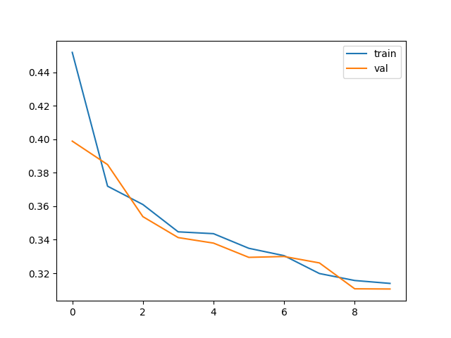
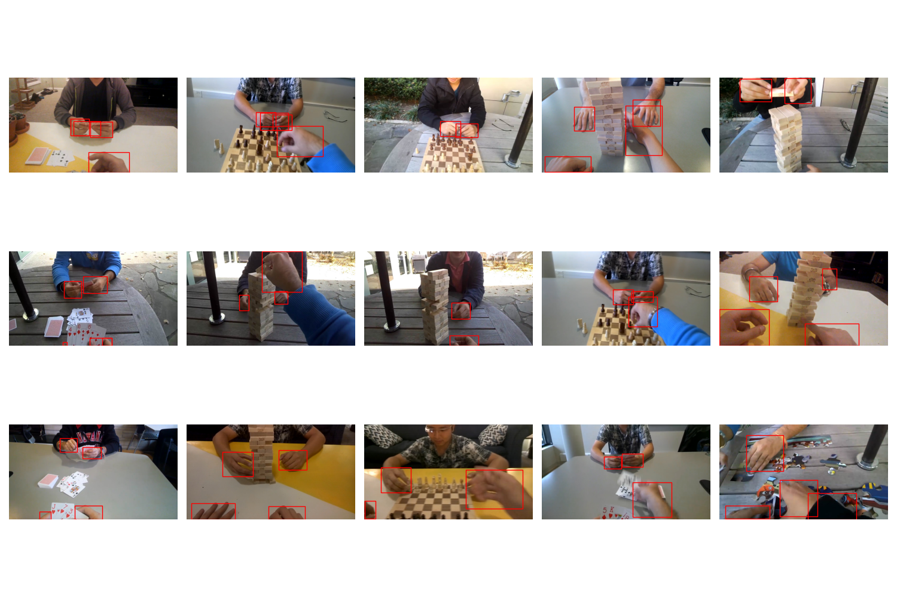

## Hand Pose Estimation
For the hand pose estimation I created a model based on a slightly simplified UNet architecture that predicts heatmaps for each 
of hands 21 keypoints. I trained this model on the FreiHAND dataset. 

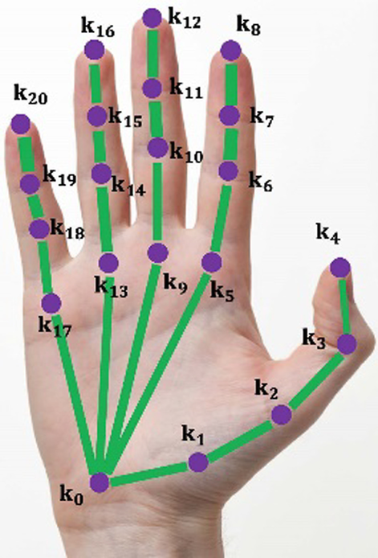

### FreiHAND dataset
This dataset consists of 32560 unique images in front of green screen and then 3 more such sets with processing to remove the green screen. The annotations for this dataset were saved in json format, so there were no issues with transfering them to Python. The only preprocessing that was required was transforming keypoints from xyz world coordinates to image plane using camera intrinsics. I also created the respective custom dataset for iterating over data during the training. 

Citations:

    @InProceedings{Freihand2019,
    author    = {Christian Zimmermann, Duygu Ceylan, Jimei Yang, Bryan Russell, Max Argus and Thomas Brox},
    title     = {FreiHAND: A Dataset for Markerless Capture of Hand Pose and Shape from Single RGB Images},
    booktitle = {IEEE International Conference on Computer Vision (ICCV)},
    year = {2019},
    url          = "https://lmb.informatik.uni-freiburg.de/projects/freihand/"
    }

### Training
To train this model I needed to create heatmaps for each keypoints as a target. To do so I applied gaussian centered in this keypoint with sigma=3:

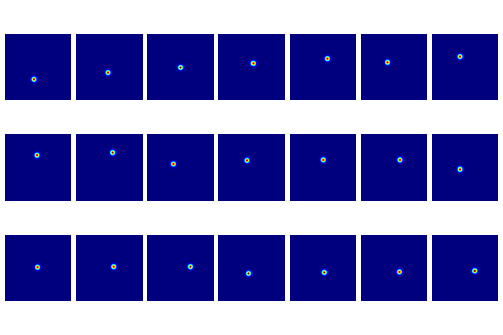

Additionally, contrary to Faster-RCNN, the data in UNet should be preprocessed and resized to the specific size. 

As I mentioned before I used a model based on UNet for this task, the only differences are that instead on 4 steps of convolution and deconvolution, I used 3 with less dimensionality for faster convergences, and the last layer of this network is 3x3 convolution instead of 1x1: 

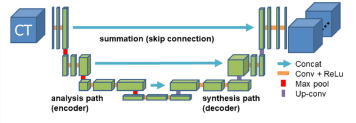

For the training of this network I used Dice loss = 1 - Dice coefficient:

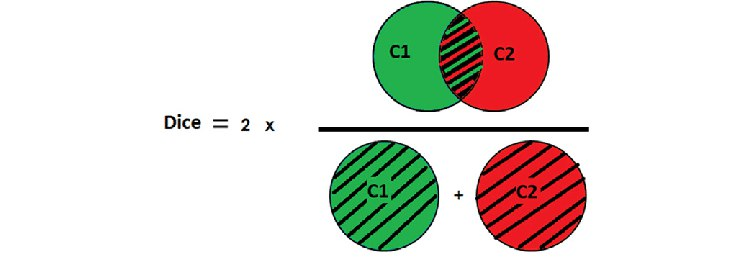

At first, I trained this model for 150 epoch only on the first 32560 images:

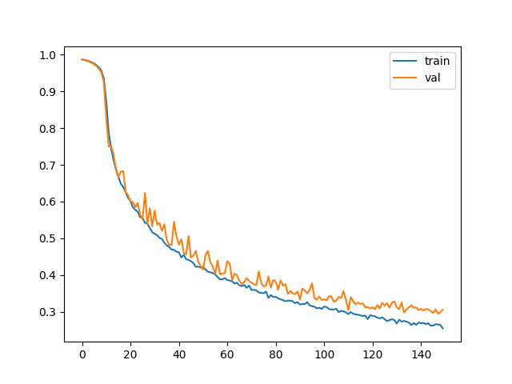

But I didn't take into account the fact that all of those images were in front of the green screen and then when I tried using the model for in the wild cases it performed poorly in front of the challenging background.

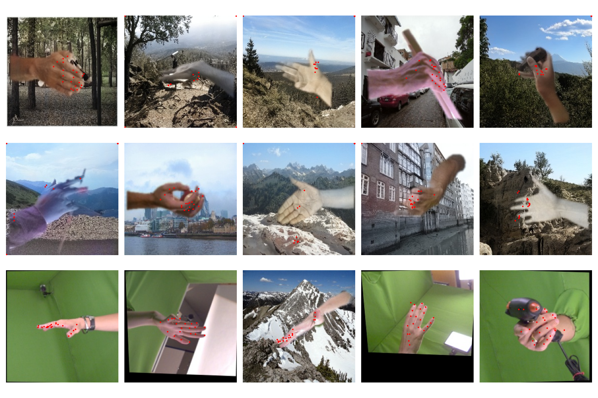

So I decided to use this pretrained model and train it further with all of the data for 100 more epochs: 

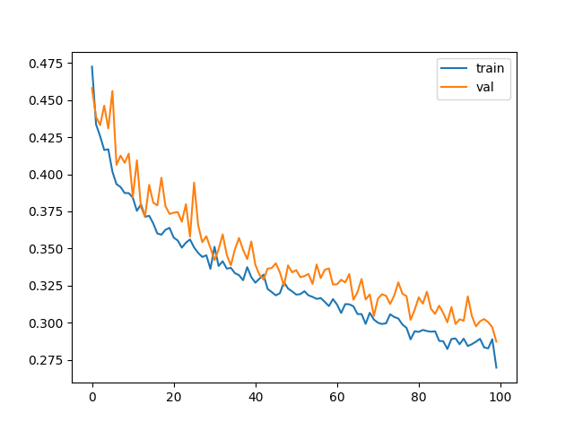
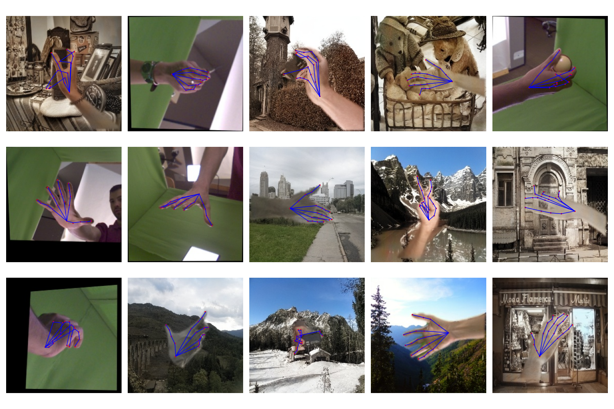

### Combined Results 

